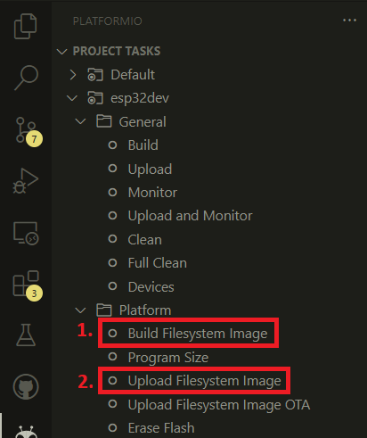
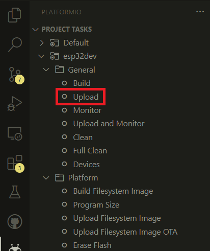

# Arducrypte led controler
Web page and program for controling WS2812b leds using the FastLED library

This project was made for an ESP32 using PlatformIO as compiler and programer and WebStorm for the web page developpment

## How to use

1. Clone the repository
2. Create a `login.h` file in the `include` folder with the following content:
```c
#ifndef LOGIN_H
#define LOGIN_H

//For AP mode
#define HOSTNAME "hostname"
#define AP_PASSWORD "ap-password"

//For STA mode
#define WIFI_SSID  "ssid"
#define WIFI_PASSWORD "password"
#endif
```
3. You can tweak the parameters in the `params.h` file to change the XY stick numbers.

4. Program the ESP32 using platformIO
   1. Build the website image using the `buildfs` command and upload it
   
   2. Upload the program using the `upload` command
   

5. Depending on the wifi mode you selected, the ESP32 will either create an access point or connect to your wifi network. You can then access the web page by going to the IP address of the ESP32 (you can find it in the serial monitor)

